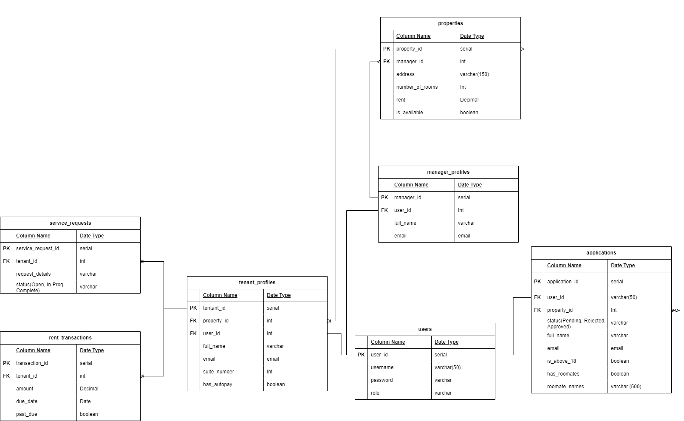

# Real-TE Management

## Description

Real-Te Management streamlines property ownership by providing a user-friendly interface. Property owners can effortlessly list, edit, and manage properties, handle tenant service requests, and track applicant applications. Tenants can submit service requests and pay rent conveniently through the app, enhancing overall property management efficiency.

## Table of Contents

- [Dependencies](#dependencies)
- [Installation](#installation)
- [Usage](#usage)
- [Features](#features)
- [API](#api)
- [Database Schema](#database-schema)
- [Frontend](#frontend)

## Dependencies
Frontend:
- [Vue.js](https://vuejs.org/)

Backend:
- [PostgreSQL](https://www.postgresql.org/)

## Installation

Provide step-by-step instructions on how to install your project. Include any dependencies that need to be installed and specify the version compatibility, if necessary. You may also include sample commands or scripts.

```bash
# Example installation commands
git clone https://github.com/yourusername/your-capstone.git
cd your-capstone
npm install
```

## Usage

Explain how users can use your project. Include examples and demonstrate the basic functionalities. If your project has a graphical user interface (GUI) or a command-line interface (CLI), provide instructions for both.

```bash
# Example usage command
node app.js
```

## Features

List and describe the key features of your project. This section helps users quickly understand what your project can do.

- Feature 1: [Description]
- Feature 2: [Description]
- ...

## API 

Link to or provide information about the documentation for your project. This could include API documentation, user guides, or any other relevant materials. If your project has an associated website, mention it here.

## Database Schema



## Frontend

